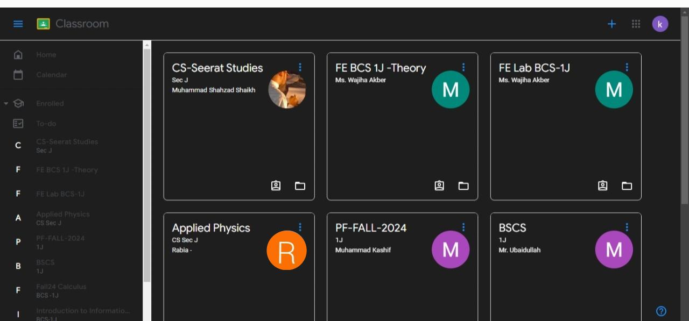
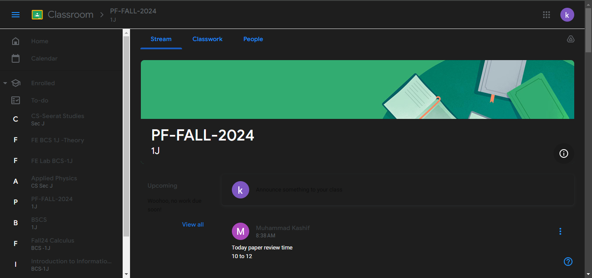

# Google Classroom Dark Mode Extension

A simple Chrome extension that changes the background color of Google Classroom to black, making it easier on the eyes, especially in low-light environments.

## Features

- **Dark Mode**: Transforms the Google Classroom interface with a black background and white text for a better viewing experience.
- **Custom Styling**: The extension uses custom CSS to adjust elements like headers, buttons, text areas, and links.
- **Easy to Use**: Just install the extension and it automatically applies the dark theme to Google Classroom pages.

## Installation

To install the Google Classroom Dark Mode Extension on your Chrome browser, follow these steps:

1. Download the extension files from this repository by clicking the **Clone or Download** button.
2. Open **Chrome** and go to `chrome://extensions/`.
3. Enable **Developer Mode** by toggling the switch in the top-right corner.
4. Click the **Load unpacked** button and select the folder where you downloaded the extension files.
5. The extension will now appear in your Chrome toolbar. Visit [Google Classroom](https://classroom.google.com) to see the dark mode applied automatically.

## Screenshots

## Contributing

We welcome contributions! To get started:

1. Fork this repository by clicking the **Fork** button at the top right of the page.
2. Clone your fork to your local machine:
